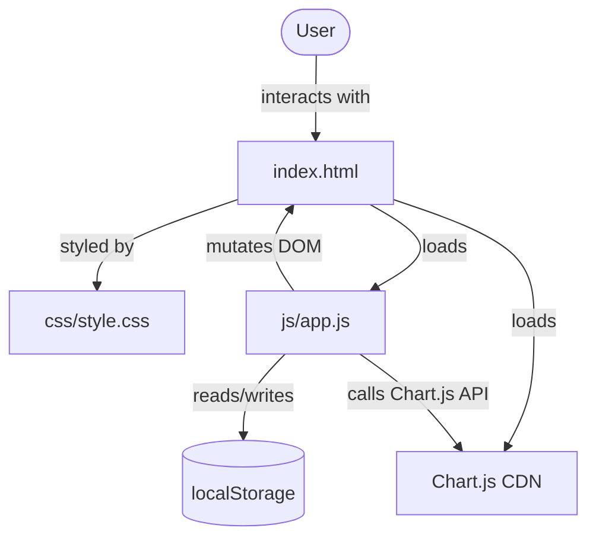
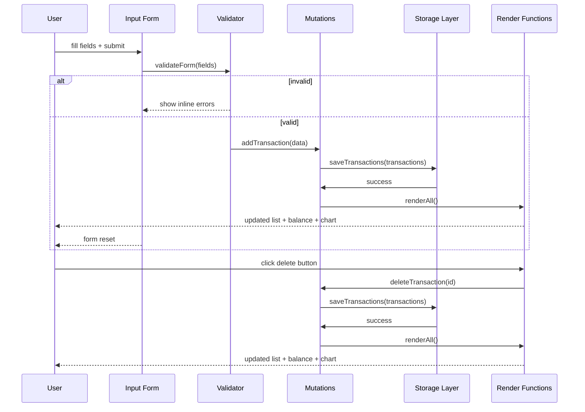

# Design Document — Expense & Budget Visualizer

## Overview

The Expense & Budget Visualizer is a standalone, client-side web application built with plain HTML, CSS, and Vanilla JavaScript. It requires no build step, no server, and no framework — the user opens `index.html` directly in a browser.

The app lets users:

1. Record expense transactions (item name, amount, category).
2. View a scrollable, reverse-chronological transaction history with per-item delete.
3. Monitor a running total balance formatted as currency.
4. Explore spending distribution via an interactive pie chart rendered by Chart.js.

All data is persisted in the browser's `localStorage` under a fixed application key. The entire UI updates synchronously in response to add and delete operations, without page reload.

### Key Design Decisions

| Decision                           | Rationale                                                                                                                                           |
| ---------------------------------- | --------------------------------------------------------------------------------------------------------------------------------------------------- |
| No framework                       | Matches the constraint of opening a single HTML file; removes build tooling and dependency management entirely.                                     |
| Single JS module (`js/app.js`)     | Keeps the file count at the mandated one CSS / one JS; internal structure uses named functions and a module-pattern IIFE to avoid global pollution. |
| Chart.js via CDN                   | Provides a full-featured charting library without a build step; loaded with a `<script>` tag in `index.html`.                                       |
| In-memory array as source of truth | `transactions[]` in JS memory mirrors localStorage; every mutating operation updates both atomically to keep them in sync.                          |
| Timestamp-based ordering           | Each transaction records a `createdAt` ISO timestamp used for reverse-chronological sorting.                                                        |

---

## Architecture

The application is structured as a single-page document with a thin logical layer over the DOM. There is no framework router or state management library; instead, a small set of pure utility functions is composed with DOM-mutation render functions.



### Module Structure inside `js/app.js`

The single JS file is partitioned into logical sections using comment headers. Each section exposes named functions; nothing except the initialization call (`init()`) runs at module scope on load.

```
js/app.js
 ├── Constants              (STORAGE_KEY, MAX_AMOUNT, CATEGORIES, etc.)
 ├── Storage Layer          (loadTransactions, saveTransactions)
 ├── Validator              (validateForm)
 ├── Transaction Mutations  (addTransaction, deleteTransaction)
 ├── Formatting Utilities   (formatCurrency, truncateName, computeChartData)
 ├── Render Functions       (renderTransactionList, renderBalance, renderChart)
 ├── Event Handlers         (handleFormSubmit, handleDeleteClick)
 └── Initialization         (init — called on DOMContentLoaded)
```

### Data Flow



---

## Components and Interfaces

### 1. Storage Layer

Responsible for reading from and writing to `localStorage`. Isolated so other modules never call `localStorage` directly.

```js
// Returns Transaction[] — malformed entries are discarded with console.error
function loadTransactions(): Transaction[]

// Serialises transactions array to JSON and writes under STORAGE_KEY
function saveTransactions(transactions: Transaction[]): void
```

**Constants:**

```js
const STORAGE_KEY = "expense_budget_visualizer_v1";
```

---

### 2. Validator

Pure function — no side effects, no DOM access.

```js
/**
 * @returns {{ valid: boolean, errors: { name?: string, amount?: string, category?: string } }}
 */
function validateForm(name: string, amount: string, category: string): ValidationResult
```

Rules:

- `name`: non-empty string, length ≤ 100
- `amount`: parseable as a finite float in `[0.01, 999_999_999.99]`
- `category`: non-empty string (one of the known categories)

---

### 3. Transaction Mutations

```js
function addTransaction(name: string, amount: number, category: string): void
function deleteTransaction(id: string): void
```

Both functions:

1. Mutate the in-memory `transactions` array.
2. Call `saveTransactions()`.
3. Call `renderAll()`.

`addTransaction` generates a UUID via `crypto.randomUUID()` and captures `new Date().toISOString()` as `createdAt`.

---

### 4. Formatting Utilities

Pure functions — suitable for unit and property-based testing.

```js
// Formats a number as currency with 2 decimal places, thousands separator, and overflow cap
function formatCurrency(amount: number): string

// Truncates a string to at most 50 characters
function truncateName(name: string): string

// Computes per-category percentages from a transaction array
function computeChartData(transactions: Transaction[]): ChartData
```

`computeChartData` returns:

```js
{
  labels: string[],           // category names
  data: number[],             // raw category totals
  percentages: number[],      // rounded to 2 decimal places
  displayPercentages: string[], // formatted label strings (handles near-zero)
  isEmpty: boolean
}
```

---

### 5. Render Functions

```js
function renderTransactionList(transactions: Transaction[]): void
function renderBalance(transactions: Transaction[]): void
function renderChart(transactions: Transaction[]): void
function renderAll(): void   // calls all three
```

`renderChart` maintains a reference to the Chart.js instance and calls `.destroy()` before re-creating to avoid canvas conflicts.

---

### 6. Event Handlers

```js
function handleFormSubmit(event: SubmitEvent): void
function handleDeleteClick(event: MouseEvent): void  // delegated on the list container
```

Event delegation is used for delete: a single click listener on the `Transaction_List` container reads the `data-id` attribute from the button.

---

### 7. Initialization

```js
document.addEventListener('DOMContentLoaded', init);

function init(): void {
  // 1. Load transactions from Storage
  // 2. renderAll()
  // 3. Attach event listeners
}
```

---

## Data Models

### Transaction

```js
/**
 * @typedef {Object} Transaction
 * @property {string}  id         - UUID (crypto.randomUUID)
 * @property {string}  name       - Item name, 1–100 characters
 * @property {number}  amount     - Positive float, 0.01–999,999,999.99
 * @property {string}  category   - One of: 'Food', 'Transport', 'Fun'
 * @property {string}  createdAt  - ISO 8601 timestamp string
 */
```

### ValidationResult

```js
/**
 * @typedef {Object} ValidationResult
 * @property {boolean} valid
 * @property {{ name?: string, amount?: string, category?: string }} errors
 */
```

### ChartData

```js
/**
 * @typedef {Object} ChartData
 * @property {string[]}  labels
 * @property {number[]}  data                - raw totals per category
 * @property {number[]}  percentages         - 2-decimal rounded share
 * @property {string[]}  displayPercentages  - formatted label strings
 * @property {boolean}   isEmpty
 */
```

### localStorage Shape

The single key `expense_budget_visualizer_v1` stores a JSON array of `Transaction` objects:

```json
[
  {
    "id": "f47ac10b-58cc-4372-a567-0e02b2c3d479",
    "name": "Lunch",
    "amount": 12.5,
    "category": "Food",
    "createdAt": "2024-01-15T12:30:00.000Z"
  }
]
```

---

## Correctness Properties

_A property is a characteristic or behavior that should hold true across all valid executions of a system — essentially, a formal statement about what the system should do. Properties serve as the bridge between human-readable specifications and machine-verifiable correctness guarantees._

### Property 1: Validator rejects invalid inputs

_For any_ form submission where at least one of the following is true — the item name is empty or exceeds 100 characters, the amount is not a finite number within `[0.01, 999,999,999.99]`, or the category is empty — `validateForm` SHALL return `{ valid: false }` and the errors object SHALL contain an entry for each offending field.

**Validates: Requirements 1.1, 1.3, 1.4, 1.5**

---

### Property 2: Validator accepts all fully valid inputs

_For any_ non-empty item name of length ≤ 100, any amount as a finite float in `[0.01, 999,999,999.99]`, and any non-empty category string, `validateForm` SHALL return `{ valid: true }` with an empty errors object.

**Validates: Requirements 1.1, 1.3**

---

### Property 3: Adding a transaction grows the list by exactly one

_For any_ valid transaction tuple `(name, amount, category)` and any starting transaction list of length `n`, calling `addTransaction` SHALL result in a transaction list of length `n + 1` containing an entry whose `name`, `amount`, and `category` match the input.

**Validates: Requirements 1.6, 2.1**

---

### Property 4: Deleting a transaction removes exactly that item

_For any_ non-empty transaction list and any transaction `id` present in that list, calling `deleteTransaction(id)` SHALL result in a list that does not contain the deleted `id` and whose length is `n - 1`.

**Validates: Requirements 2.4, 5.2**

---

### Property 5: Transaction list order is reverse-chronological

_For any_ array of transactions with distinct `createdAt` timestamps, the rendered transaction list order SHALL place transactions with later `createdAt` values before transactions with earlier `createdAt` values (newest first).

**Validates: Requirements 2.3**

---

### Property 6: Item name truncation invariant

_For any_ string `s`, `truncateName(s)` SHALL return a string whose length is `Math.min(s.length, 50)`. If `s.length ≤ 50`, the result SHALL equal `s`. If `s.length > 50`, the result SHALL equal `s.slice(0, 50)`.

**Validates: Requirements 2.7**

---

### Property 7: Balance sum correctness

_For any_ array of transactions with amounts `[a₁, a₂, …, aₙ]`, the balance sum SHALL equal `a₁ + a₂ + … + aₙ` within floating-point tolerance (`< 0.001`). For an empty array the sum SHALL be `0`.

**Validates: Requirements 3.1, 3.5**

---

### Property 8: Currency formatting always produces two decimal places

_For any_ non-negative number `n` within the displayable range, `formatCurrency(n)` SHALL return a string that ends with exactly two decimal digits (i.e., matches `/\.\d{2}$/`), and for any `n ≥ 1000` the string SHALL contain at least one thousands-separator comma.

**Validates: Requirements 3.4**

---

### Property 9: Balance display overflow cap

_For any_ array of transactions whose arithmetic sum `S` exceeds `999,999,999.99`, the formatted balance display SHALL show `"999,999,999.99"` and include an overflow indicator. For any sum `S ≤ 999,999,999.99`, no overflow indicator SHALL appear.

**Validates: Requirements 3.6**

---

### Property 10: Pie chart percentages are non-negative and sum to 100

_For any_ non-empty array of transactions, `computeChartData` SHALL return `percentages` where every value is `≥ 0`, no value exceeds `100`, and the sum of all values equals `100` within a tolerance of `0.1`.

**Validates: Requirements 4.1**

---

### Property 11: JSON serialization round-trip preserves all transaction fields

_For any_ array of valid `Transaction` objects, `loadTransactions(saveTransactions(transactions))` SHALL return an array of equal length where each element has the same `id`, `name`, `amount`, `category`, and `createdAt` as the corresponding input element.

**Validates: Requirements 5.1, 5.3, 5.4**

---

### Property 12: Partial-invalid load discards only malformed entries

_For any_ JSON array that is a mixture of valid `Transaction` objects and objects missing one or more required fields (`id`, `name`, `amount`, `category`), `loadTransactions` SHALL return an array containing exactly the valid entries and none of the malformed entries.

**Validates: Requirements 5.6**

---

## Error Handling

| Scenario                                            | Detection                                             | Response                                                                                     |
| --------------------------------------------------- | ----------------------------------------------------- | -------------------------------------------------------------------------------------------- |
| Form field empty on submit                          | `validateForm` returns errors                         | Inline error message per field; transaction not added; form not reset                        |
| Amount out of range or non-numeric                  | `validateForm` returns `errors.amount`                | Inline error adjacent to amount field; transaction not added                                 |
| `localStorage` write failure (e.g., quota exceeded) | `try/catch` around `saveTransactions`                 | Error message displayed in UI; in-memory state reverted to pre-mutation snapshot             |
| `localStorage` read returns non-JSON                | `JSON.parse` throws                                   | `loadTransactions` returns `[]`; `console.error` with descriptive message                    |
| `localStorage` entry missing required field         | Field-presence check in `loadTransactions`            | That entry is discarded; `console.error` per discarded entry; remaining valid entries loaded |
| Chart.js not loaded (CDN failure)                   | `typeof Chart === 'undefined'` check in `renderChart` | Pie chart area shows a user-visible error message; rest of UI remains functional             |
| `crypto.randomUUID` unavailable (very old browser)  | Feature-detect on startup                             | Fallback UUID generated from `Math.random` hex strings                                       |

---

## Testing Strategy

### Tooling

| Layer                 | Tool                                      | Notes                                                 |
| --------------------- | ----------------------------------------- | ----------------------------------------------------- |
| Unit & property tests | **fast-check** (CDN or devDependency)     | JavaScript property-based testing library             |
| Test runner           | **Jest** or **Vitest**                    | Either works; no build step needed for the app itself |
| Browser compatibility | Manual testing                            | Chrome, Firefox, Edge, Safari current stable          |
| Visual / responsive   | Manual testing at 320 px, 768 px, 1440 px | Verify layout breakpoints                             |

> **Note on build separation:** The app itself requires no build step. The test suite may use Node.js + Jest/Vitest as a development-only concern, testing the pure utility functions extracted from `app.js` (or a testable subset). The production `index.html` remains build-free.

### Unit Tests

Focus on concrete examples, edge cases, and integration points:

- `validateForm`: empty name, empty amount, empty category, valid full input, name exactly 100 chars, amount exactly 0.01, amount exactly 999,999,999.99
- `formatCurrency`: 0 → `"0.00"`, 1000 → `"1,000.00"`, 999999999.99 → `"999,999,999.99"`, 1234567.89 → `"1,234,567.89"`
- `truncateName`: 50-char string unchanged, 51-char string truncated to 50
- `computeChartData`: empty array, single-category, three categories including near-zero share
- `loadTransactions`: valid JSON, invalid JSON, valid + malformed mix, empty array

### Property-Based Tests

Each property test references its design document property and runs a minimum of 100 iterations.

```
// Tag format: Feature: expense-budget-visualizer, Property N: <property text>
```

| #   | Property                                         | Generator                                                                      | Assertion                                                         |
| --- | ------------------------------------------------ | ------------------------------------------------------------------------------ | ----------------------------------------------------------------- |
| 1   | Validator rejects invalid inputs                 | Arbitrary strings with at least one invalid field                              | `result.valid === false` and matching error key present           |
| 2   | Validator accepts all valid inputs               | Non-empty strings ≤100, floats in `[0.01, 999_999_999.99]`, non-empty category | `result.valid === true`, `errors` empty                           |
| 3   | Adding a transaction grows list by one           | Arbitrary valid transaction tuple + arbitrary starting list                    | `list.length === n + 1` and new item found in list                |
| 4   | Deleting a transaction removes exactly that item | Arbitrary non-empty list, pick random existing id                              | `list.length === n - 1`, deleted id absent                        |
| 5   | Reverse-chronological order                      | Arbitrary array of transactions with shuffled timestamps                       | Adjacent pairs satisfy `list[i].createdAt >= list[i+1].createdAt` |
| 6   | Truncation invariant                             | Arbitrary strings of arbitrary length                                          | `truncateName(s).length === Math.min(s.length, 50)`               |
| 7   | Balance sum correctness                          | Arbitrary arrays of floats in `[0.01, 999_999_999.99]`                         | Sum matches `reduce(+, 0)` within tolerance                       |
| 8   | Currency formatting 2 decimal places             | Arbitrary non-negative floats in range                                         | Output matches `/\.\d{2}$/`; ≥1000 contains comma                 |
| 9   | Overflow cap                                     | Arbitrary arrays whose sum > 999,999,999.99                                    | Display shows capped value + overflow indicator                   |
| 10  | Pie chart percentages sum to 100                 | Arbitrary non-empty transaction arrays                                         | All percentages ≥ 0, sum within 0.1 of 100                        |
| 11  | Serialization round-trip                         | Arbitrary valid transaction arrays                                             | `loadTransactions(saveTransactions(txs))` deep-equals input       |
| 12  | Partial-invalid filter                           | Arbitrary mix of valid and malformed transaction objects                       | Result contains exactly the valid subset                          |

### Integration / Smoke Tests

Performed manually or with a simple browser automation script:

- Open `index.html` directly in each target browser — verify interactive within 3 seconds
- Add a transaction — verify list, balance, and chart all update without reload
- Delete a transaction — verify list, balance, and chart all update
- Refresh page — verify all data persists from localStorage
- Inject invalid JSON into `expense_budget_visualizer_v1` key — verify app loads with empty state and console error
- Resize viewport to 320 px, 768 px, 1440 px — verify no horizontal scroll, correct column layout
- Add 500 transactions in a loop — verify add/delete completes within 100 ms
